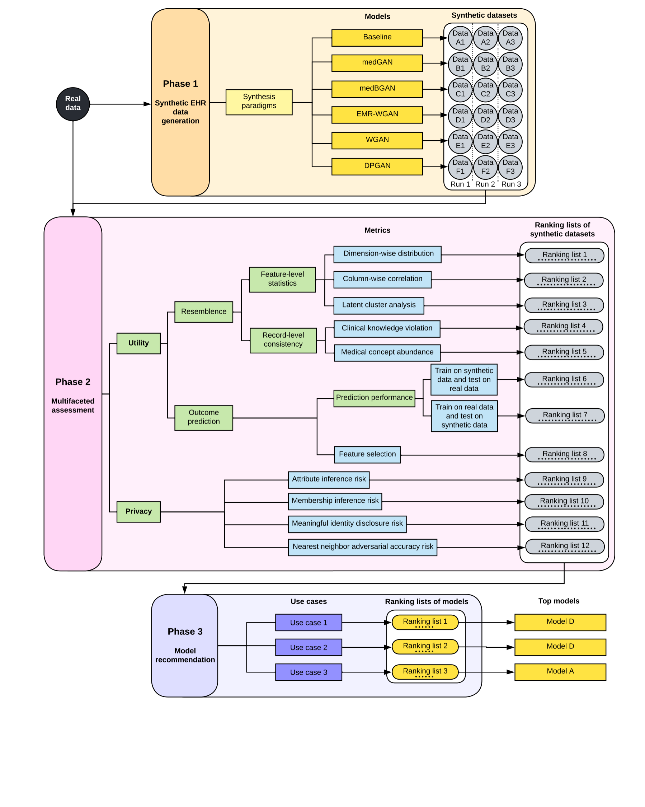

# Benchmarking framework of synthetic electronic health record generation models
---
## Overview
---
This document describes how to benchmark Generative Adversarial Networks(GANs)-based approaches for generating synthetic electronic health record (EHR) data. The figure below describes the benchmarking framework, which involves three phases - Synthetic EHR data generation,  multifaceted assessment and model recommendation.

The result of this work has been made public at arXiv: [A Multifaceted Benchmarking of Synthetic Electronic Health Record Generation Models](https://arxiv.org/abs/2208.01230)

### Reference:
*Yan C, Yan Y, Wan Z, Zhang Z, Omberg L, Guinney J, Mooney SD, Malin BA. A Multifaceted Benchmarking of Synthetic Electronic Health Record Generation Models. arXiv preprint arXiv:2208.01230.*




## System requirement

### OS Requirements
This package is supported for *Linux*. The package has been tested on the following systems:
+ Linux: Ubuntu 20.04

### Python Dependencies

```
numpy
pandas
matplotlib
scipy
sklearn
lightgbm
shap
joblib
seaborn
```

## Synthetic EHR data generation
---
We used this framework to evaluate five GAN models that were designed to synthesize structured EHR profiles of patients: 1) medGAN, 2) medBGAN, 3) EMR-WGAN, 4) WGAN, and 5) DPGAN. Additionally, we incorporated a baseline approach that randomly samples the values of features based on the marginal distributions of the real data  to complement the scope of benchmarking in terms of the variety of model behavior. We refer to this approach as the sampling baseline, or Baseline.

## Multifaceted assessment
---
The Multifaceted assessment phase focuses on two perspectives — utility and privacy
### Utility
In earlier investigations, the term utility was defined in parallel with resemblance (i.e., the statistical similarity of two datasets), and was specifically used to refer to the value of real or synthetic data to support predictions. By contrast, in this work, data utility is defined to cover a general set of metrics, each measuring a factor to which the value of data is attributed. This is because numerous real-world use cases of synthetic data do not involve any prediction tasks, but still require the synthetic data to be useful (or has utility).

We included eight metric for utility evaluation:
- **Feature-level statistics**
  - Dimension-wise distribution
  - Column-wise correlation
  - Latent cluster analysis
-  **Outcome prediction**
   - Train on real data test on synthetic data (TRTS) Model performance
   - Train on synthetic data test on real data (TSTR) Model performance
   - Feature selection
- **Record-level consistency**
  -  Clinical knowledge violation
  -  Medical concept abundance
   
  
### Privacy
We focused on four types of privacy attacks that have targeted fully synthetic patient datasets:
- **Attribute inference**
- **Membership inference**
- **Meaningful identity disclosure**
- **Nearest neighbor adversarial accuracy (NNAA)**

## Model recommendation
---
We consider three use cases of synthetic data to demonstrate generative model selections in the context of specific needs. The benchmarking framework translates a use case into weights on the metric-level results. By default, a weight of 0.1 was assigned to each metric and all weights sum to 1. We adjusted the weights according to the needs of the use case. The following provides a summary of the use case, while the detailed weight profiles are provided below.

|Use case | Dimension-wide distribution | Column-wise correlation| Latent cluster analysis| Prediction performance| Feature selection| Clinical knowledge violation | Medical concept abundance| Attribute inference| Membership inference| Meaningful identity disclosure| NNAA risk
| ----------- | ----------- | ----------- | ----------- | ----------- | ----------- | ----------- | ----------- |----------- | ----------- | ----------- | ----------- |
|Education | 0.25|0.15| 0.05| 0.05| 0.05| 0.15| 0.1| 0.05| 0.05| 0.05 | 0.05|
Medical AI development|0.04|0.04|0.04|0.35|0.15|0.04|0.04|0.075|0.075|0.075|0.075|
|System design|0.15|0.04|0.04|0.04|0.04|0.04|0.15|0.125|0.125|0.125|0.125|


We provided the following two files (which include the results from all considered metrics) as input for the model recommendation step.

`./model_recommendation/rank_utility_privacy.csv` - separate ranking for UW and VUMC data under different synthesis paradigms.

`./model_recommendation/rank_utility_privacy.csv` - comparison rank for UW synthetic data generated under combined and separate synthesis paradigms.

The final score is calculated using `./model_recommendation/use_case.ipynb` 

To be noticed, the weights for each metric can be adjusted to suit the evaluation needs for other use cases that are not included in the study.
## Data
---
The example data are for demonstration only, so they are randomly generated. However, they are in the same format as the real datasets we used in our experiments except that the number of records in each real dadtaset is about ten times of the number of records in the corresponding example dataset. Some summary statistics about the example data are provided below.

|Dataset | Number of records (rows)| Number of features (columns) |
| ----------- | ----------- | ----------- |
|UW training | 13213 | 2670 |
|UW test | 13213 | 2670 |
|UW population | 46698 | 2670 |
|VUMC training | 1434 | 2596 |
|VUMC test | 615 | 2596 |
|VUMC population | 63303 | 2596

All the names for binary medical features in the datasets shown in the headlines files have been converted to pseudonyms. Besides binary medical features, the UW datasets have features including race and gender. The race feature has been one-hot coded into six binary features. The gender is a binary feature. Besides binary medical features, the VUMC datasets have features including race, age, gender, and 7 continuous medical features. The race feature has been one-hot coded into five binary features. The gender is a binary feature. The age is a continuous feature.

## Instructions for usage
---
### Utility

The evaluation for all utility metrics above uses Jupyter Notebook files under './utility_evaluation/', in which the intermediate results and figures that shown in the paper are put inline. 

### Privacy

Privacy risk analysis were packaged into Python source files. See './privacy_evaluation/README_RISK_MODEL.txt' for detailed instructions.

Usage: synthetic_risk_model_mem.py [model] [exp_id] [beta] [train_filename] [test_filename] [prefix_syn] [infix_syn] [output_directory]

Usage: synthetic_risk_model_attr.py [model] [exp_id] [x] [y] [original_filename] [prefix_syn] [infix_syn] [output_directory]

Usage: synthetic_risk_model_reid.py [model] [exp_id] [theta] [original_filename] [pop_filename] [prefix_syn] [infix_syn] [output_directory]

Usage: synthetic_risk_model_nnaa.py [model] [exp_id] [train_filename] [test_filename] [prefix_syn] [infix_syn] [output_directory]
